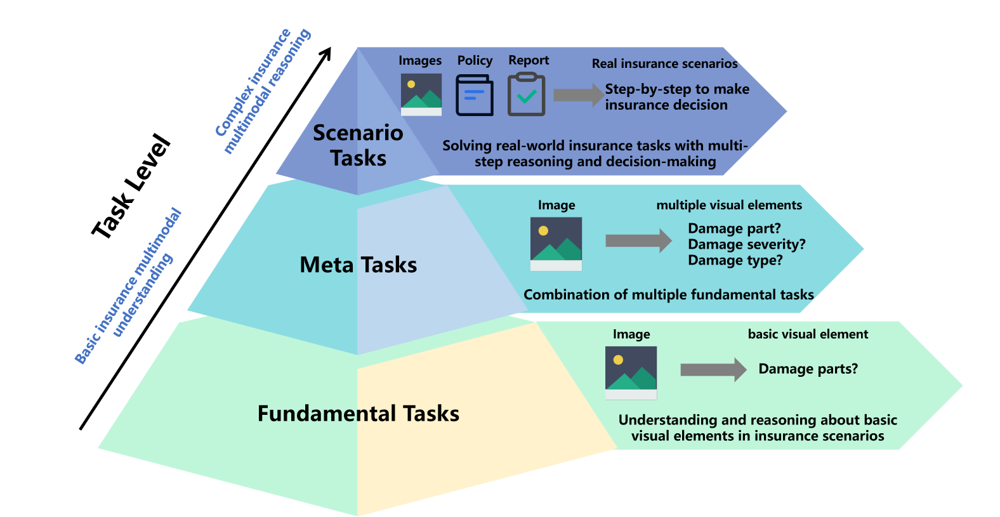
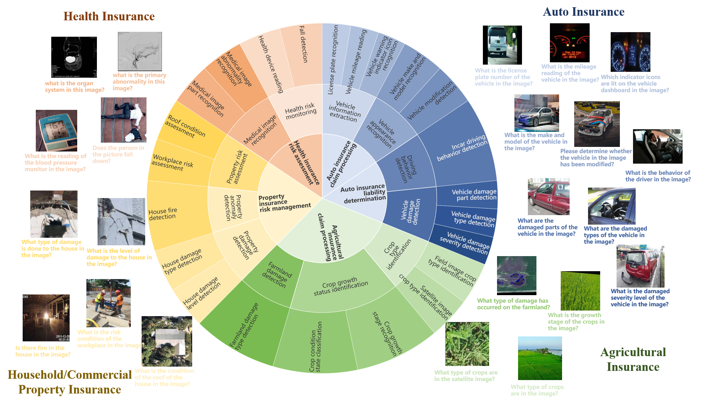
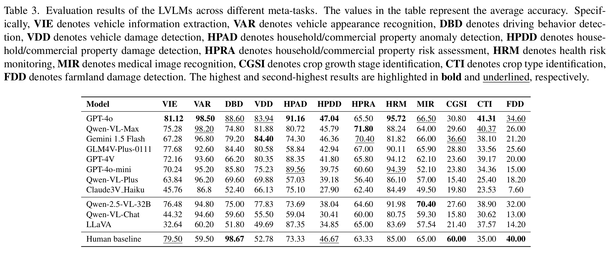
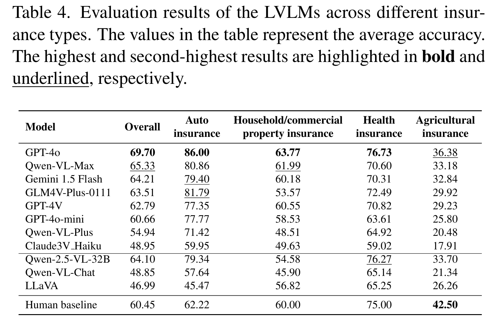
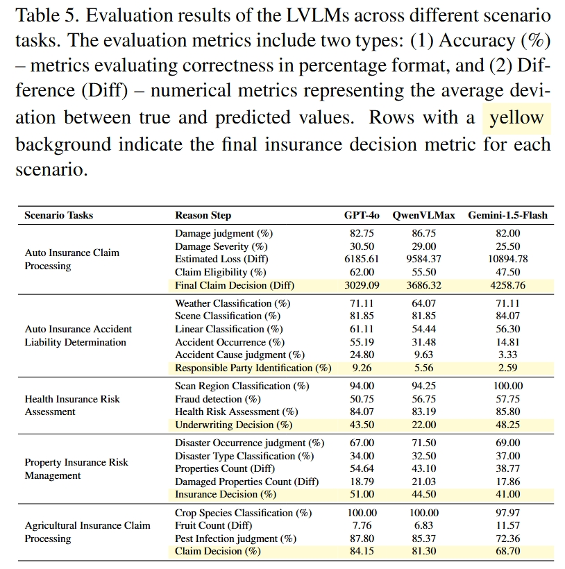

# INS-MMBench: A Comprehensive Benchmark for Evaluating LVLMs' Performance in Insurance
[📄Paper Link](https://arxiv.org/pdf/2406.09105) | [🤗Hugging face](https://huggingface.co/datasets/FDU-INS/INS-MMBench)

> INS-MMBench: A Comprehensive Benchmark for Evaluating LVLMs' Performance in Insurance
> 
> Chenwei Lin<sup>1</sup>, Hanjia Lyu<sup>2</sup>, Xian Xu<sup>1</sup>, Jiebo Luo<sup>2</sup>  
<sup>1</sup> Fudan University  <sup>2</sup> University of Rochester

🔥 Accepted for publication in [ICCV 2025](https://iccv.thecvf.com/)

## Introduction
INS-MMBench is the first comprehensive LVLMs benchmark for the insurance domain, it covers four representative insurance types: auto, property, health, and agricultural insurance and key insurance stages such as risk underwriting, risk monitoring and claim processing. INS-MMBench consists of three layers task: 
 - Fundamental task, which focuses on the understanding of individual insurance-related visual elements;
 - Meta-task, which involves the compositional understanding of multiple insurance-related visual elements;
 - Scenario task, which pertains to real-world insurance tasks requiring multi-step reasoning and decision-making.

INS-MMBench includes a total of 12,052 images, 10,372 thoroughly designed questions (including multiple-choice visual questions and free-text visual questions), comprehensively covering 5 scenario tasks, 12 meta-tasks and 22 fundamental tasks.
<div style="display: flex; justify-content: center;">
    
    
</div>

## Evaluation Results Overview
Our experiments consist of two stages. In the first stage, we evaluate meta-tasks and fundamental tasks, conducting evaluation on all selected LVLMs to assess their performance in fundamental multimodal insurance tasks. In the second stage, we select a subset of top-performing models for further scenario task evaluation, where models are evaluated on end-to-end multimodal reasoning tasks to assess their effectiveness in real-world insurance applications. According to the evaluation results, we have following observations:

- GPT-4o leads in performance but highlights challenges for LVLMs in insurance tasks: GPT-4o outperforms all other models with a score of **69.70**, but most LVLMs do not significantly surpass human performance across various insurance tasks, indicating substantial room for improvement in this domain.  

- LVLMs show significant variance across different insurance types and meta-tasks: LVLMs perform better in **auto and health insurance** tasks than in **property and agricultural insurance**, excelling in **visual perception tasks** but struggling with **knowledge-intensive reasoning tasks**, suggesting a progressive adoption strategy focused on their strengths.  

- LVLMs exhibit significant limitations in complex insurance scenarios: Current LVLMs face challenges in **multi-step reasoning**, with only a few tasks exceeding **80% accuracy**, emphasizing the need for **domain-specific datasets** and **reinforcement learning** to enhance reasoning capabilities for insurance applications.  

- Narrowing gap between open-source and closed-source LVLMs: While **closed-source LVLMs** still hold an advantage, some **open-source models** are approaching comparable performance, indicating that **training high-performance, domain-specific LVLMs** could be a key strategy for insurance applications.  

<div style="display: flex; justify-content: center;">
    
</div>

<div style="display: flex; justify-content: center;">
    
    
</div>

## Quick start
### Step 1: Installation
To set up the project, run the following commands:

```bash
git clone https://github.com/FDU-INS/INS-MMBench.git
cd INS-MMBench
pip install -r requirements.txt
```

### Step 2: Configuration

#### 1. VLM Configuration
- All VLMs are configured in `vlmeval/config.py`.
- For some VLMs, you need to configure the **code root** (e.g., MiniGPT-4, PandaGPT) or the **model_weight root** (e.g., LLaVA-v1-7B) before conducting the evaluation.
- During evaluation, use the model name specified in `supported_VLM` in `vlmeval/config.py` to select the VLM.
- For models not listed in `supported_VLM`, you can customize the configuration.

#### 2. Benchmark Download
- The datasets can be downloaded through the provided [Hugging Face link](https://huggingface.co/datasets/FDU-INS/INS-MMBench) .
- Place the dataset folder in the default path `$HOME/LMUData` or a custom path.

#### 3. `.env` File Setup
- Update the `.env` file with necessary information such as API keys, base URLs, and other settings required for model integration.

---

### Step 3: Evaluation

- Use the `run.py` script for evaluation. 
- You can execute it via `$VLMEvalKit/run.py` or create a soft-link to use the script anywhere.

#### Arguments
| Argument     | Type        | Description                                                                                      |
|--------------|-------------|--------------------------------------------------------------------------------------------------|
| `--data`     | `list[str]` | Specify dataset names supported in VLMEvalKit (defined in `vlmeval/utils/data_util.py`).          |
| `--model`    | `list[str]` | Specify VLM names supported in VLMEvalKit (defined in `supported_VLM` in `vlmeval/config.py`).    |
| `--mode`     | `str`       | Evaluation mode: `"all"` (default) for both inference and evaluation; `"infer"` for inference only. |
| `--nproc`    | `int`       | Number of threads for OpenAI API calling (default: 4).                                           |
| `--verbose`  | `bool`      | Enable verbose logging.                                                                          |

#### Example Command
```bash
python run.py --data INS-MMBench --model GPT4o --verbose --nproc 4
```
The final results will be saved in a folder named after the model used for evaluation.

## 🔁 Reproducibility
### Table 3
```bash
python reproducibility/table_3.py
```
### Table 4
```bash
python reproducibility/table_4.py
```
### Table 5
```bash
python reproducibility/table_5.py
```
### Table 6
```bash
python reproducibility/table_6.py
```
### Table 7
```bash
python reproducibility/table_7.py
```

## 🖊️ Citation 
If you find our work useful in your project or research, please use the following BibTeX entry to cite our paper. Thanks!
```
@article{insmmbench,
    title={INS-MMBench: A Comprehensive Benchmark for Evaluating LVLMs’ Performance in Insurance}, 
    author={Lin, Chenwei and Lyu, Hanjia and Xu, Xian and Luo, Jiebo},
    journal={arXiv preprint arXiv:2406.09105},
    year={2024}
}
```

## 📜 Related Works
Explore our related researches:
- [Harnessing gpt-4v (ision) for insurance: A preliminary exploration](https://arxiv.org/pdf/2404.09690)

## 💐 Acknowledgement
We express our sincere gratitude to the following projects:
- [VLMEvalKit](https://github.com/open-compass/VLMEvalKit) provides useful out-of-the-box tools and implements many advanced models. Thanks for their selfless dedication.
